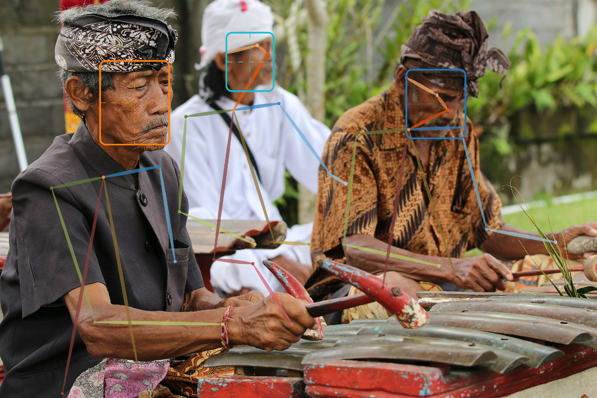
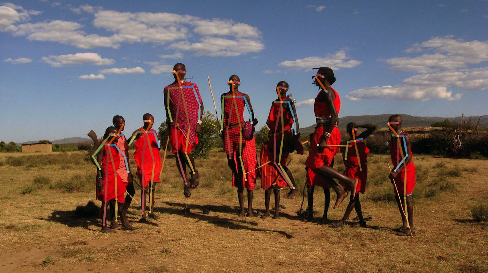

terran

---

**Terran** is a human perception library that provides computer vision
techniques and algorithms in order to facilitate building systems that interact
with people.

The philosophy behind the library is to focus on tasks and problems instead of
models and algorithms. That is, we aim to always have the best possible
algorithm for the job given its constraints, and to take the burden of finding
which model performs best off you.

The library strives to be friendly and easy-to-use. It's written fully in
Python and Pytorch, avoiding C++ extensions as much as possible, in order to
avoid difficulties in installation. Just `pip install` and you're good to go!

We (currently) provide models for: **face detection**, **face recognition** and
**pose estimation**. We also offer several utility functions for efficiently
reading and visualizing results, which should simplify work a bit.

<p align="center">
  <br>
  <sup>
    Example of Terran's face detection and pose estimation capabilities.
  </sup>
</p>

# Features

* Efficient I/O **utilities to read and write videos** through `ffmpeg`. Frames
  are pre-fetched in a background thread, allowing you to maximize GPU usage
  when processing videos.

* Utilities to **open remote images**, recursively find images, and (prettily)
  **visualize results**. We also allow reading from **video streams** and even
  videos from **video platforms** supported by
  [Youtube-DL](https://github.com/ytdl-org/youtube-dl/).

* **Checkpoint management tool**, so you don't have to manually download
  pre-trained model files.

* **Face detection** provided through the *RetinaFace* model.

* **Face recognition** provided through the *ArcFace* model.

* **Pose estimation** provided through the *OpenPose* model (2017 version).

# Getting started

Be sure to read the **full documentation** [here]().

## Installation

Terran requires Python 3.6 or above, and Pytorch 1.3 or above. It can be used
with or without a GPU, though the current available algorithms require GPUs in
order to run under a reasonable time.

To install, run:

```bash
pip install terran
```

If you require a particular Pytorch version (e.g. you're using a specific CUDA
version), be sure to install it beforehand.

## Usage

See the [Examples](#examples) section for more in-depth examples.

You can use the functions under `terran.io.*` for easy reading of media files,
and the appropriate algorithm function under the top-level module. If you don't
need [any customization](#customizing-model-settings), just issue the following
in an interactive console:

```python
>>> from terran.io import open_image
>>> from terran.vis import display_image, vis_faces
>>> from terran.face import face_detection
>>>
>>> image = open_image('examples/readme/many-faces-raw.jpg')
>>> detections = face_detection(image)
>>> display_image(vis_faces(image, detections))
```

<p align="center">
  
</p>

If it's the first use, you should be prompted to download the model files. You
can also do it manually, by running `terran checkpoint list` and then
`terran checkpoint download <checkpoint-id>` in a terminal.

Or maybe:

```python
>>> from terran.vis import vis_poses
>>> from terran.pose import pose_estimation
>>>
>>> image = open_image('examples/readme/many-poses-raw.jpg')
>>> display_image(vis_poses(image, pose_estimation(image)))
```

<p align="center">
  
</p>

# Examples

## Finding a person in a group of images

You can use Terran's I/O utilities to quickly find a person within all the
images present in a directory, in a *Google Photos*-like functionality. The
code is present at [examples/match.py](examples/match.py).

```bash
python examples/match.py reference.png images/
```

Here `reference.png` is the path to the reference person, which should contain
only one person, while `images/` is the directory containing the images to
search in.

(TODO: Diagram showing process and matching of images to photos.)

## Face detection over a video

Terran also provides functions to perform I/O over videos, in order to read
them efficiently and in a background thread, as well as to write them. See
[examples/video.py](examples/video.py) to see a short example of running face
detection over a video.

```bash
python examples/video.py video.mp4 out.mp4
```

Here `video.mp4` is the video to run the face detection over, and `out.mp4` the
output location.

(TODO: Example gif output.)

Note that `video.mp4` could be a Youtube video or the path to your webcam. For
instance:

```bash
python examples/video.py 'https://www.youtube.com/watch?v=oHg5SJYRHA0' out.mp4 --duration=30
```

You could also mix this example and the one above to search for a person within
a video. We leave it as an exercise for the reader.

## Customizing model settings

You might want to customize any of the detection functions (such as
`face_detection`) in order to change e.g. the size images are resized to (in
order to make it run faster). You can do it like so:

```python
from terran.face import Detection

face_detection = Detection(short_side=208)

image = open_image(...)
detections = face_detection(image)
```

# License

Terran is released under the [BSD 3-Clause](LICENSE) license.
